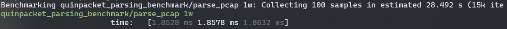
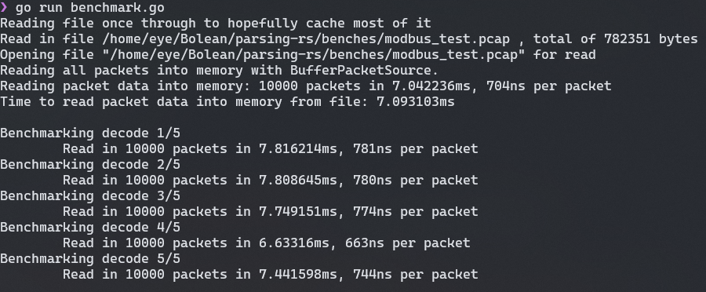
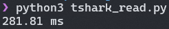
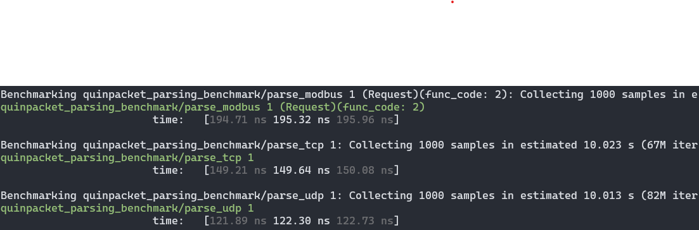
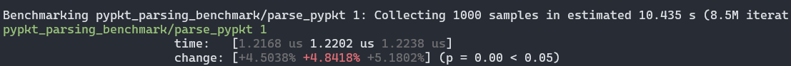

# Benchmark Result


## Test Env

* os: Linux(WSL2 Ubuntu)
* arch: amd64
* cpu: AMD Ryzen 7 4800U with Radeon Graphics 1.80 GHz


## Reproduction

### Parsing-rs & pypkt
```bash
# install pypkt (https://gitee.com/bolean-tech/bolean-pypkt-c/)
sudo apt-get install cmake libpcap-dev libpcre3-dev libclang-dev
# if you get errors when installing clang, please check: https://stackoverflow.com/questions/67383617/unable-to-install-rstudio-cannot-install-libclang-dev
git clone https://gitee.com/bolean-tech/bolean-pypkt-c.git
cd bolean-pypkt-c
mkdir build && cd build
cmake ..
make
sudo make install # files install to /usr/local/include/pypkt/ & /usr/local/lib/libpypkt.so & /usr/local/bin/libpypkt.so
# install cargo-criterion (https://github.com/bheisler/cargo-criterion)
cargo install cargo-criterion
# download parsing-rs
git clone https://gitee.com/BoleanTech/parsing-rs.git
# into ./benches dir and do benchmarking
cd ./parsing-rs/benches
cargo criterion --bench parsing --all-features
```

* tips1: 您可能需要自行安装libpcap-dev，如MacOS系统中使用: `brew install libpcap`
* tips2: 您可能需要调整benches/build.rs中`/usr/local/include/pypkt/dissect.h`内容，修改为当前环境中pypkt的安装路径

### gopacket
* `$ git clone https://github.com/google/gopacket.git && cd gopacket/pcap/gopacket_benchmark`
* 修改 benchmark.go 文件 main() 函数下`filename := os.TempDir() + string(os.PathSeparator) + "gopacket_benchmark.pcap"`，变更为`modbus_test.pcap`所在路径
* 修改 benchmark.go 文件 benchmarkLayerDecode() 函数下`var icmp layers.ICMPv4`，变更为`var modbus layers.ModbusTCP`
* 修改 benchmark.go 文件 benchmarkLayerDecode() 函数下`&eth, &ip, &icmp, &tcp, &udp, &payload)`，变更为`&eth, &ip, &modbus, &tcp, &udp, &payload)`
* `$ go run benchmark.go`

### tshark
* `pip3 install pyshark`
* `python3 tshark_read.py`


## Result

### Pcap 10000 (Modbus)
测试用例采用应用层协议以ModbusTcp为主的Pcap进行测试。
* Parsing-rs(QuinPacket): about 1.8 ms / 5550000 pps (含读取pcap的损耗)

* [gopacket](https://github.com/google/gopacket)(PacketDecode): about 7.5ms / 1330000 pps (不含读取pcap的损耗)

* tshark: about 270ms / 37000pps (不含读取pcap的损耗)


### Packet 1 (Modbus)
测试用例采用硬编码u8 slice的Modbus Packet。
* QuinPacket: about 180 ns / 5550000 pps

* [pypkt](https://gitee.com/bolean-tech/bolean-pypkt-c/): about 2.0 µs / 500000 pps

